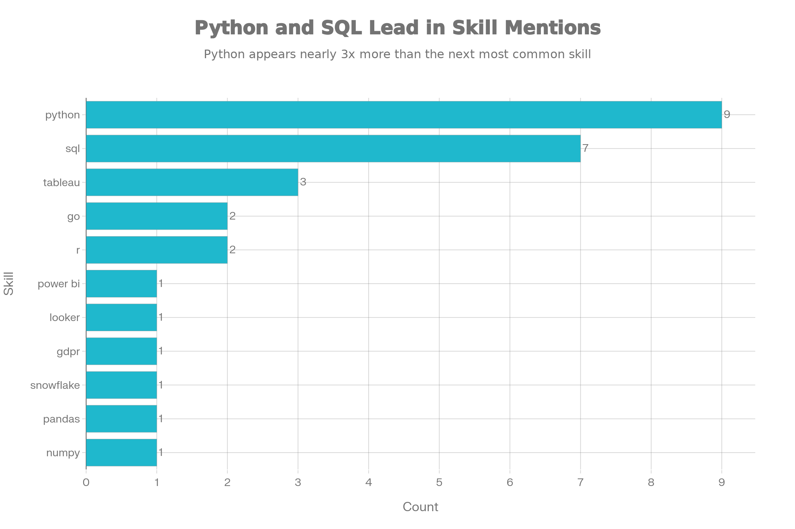
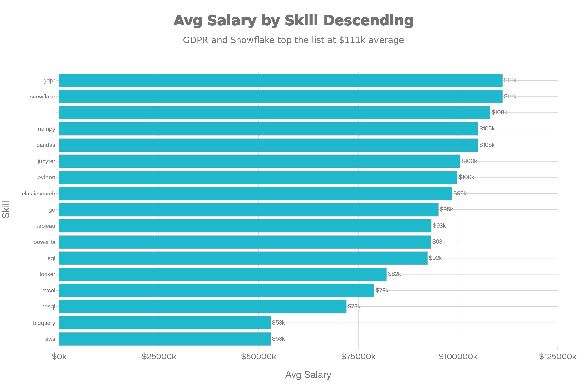

# 📊 Israeli Data Analyst Job Market Analysis (SQL Project)

## Introduction
Dive into the data job market!  
Focusing specifically on **data analyst roles in Israel**, this project explores:

- 💰 Top-paying jobs  
- 🔥 In-demand skills  
- 🎯 Where high demand intersects with high salary  

All insights are derived from **SQL-based analysis of 2023 job posting data**.

📁 **SQL queries used in this project:**  
👉 [project_sql folder](/project_sql/)

---

## Background
### The questions I wanted to answer through my SQL queries (as guided by Luke):

1. What are the **top-paying data analyst jobs** in Israel?
2. What **skills are required** for these top-paying jobs?
3. What **skills are most in demand** for Israeli data analysts?
4. Which **skills are associated with higher salaries**?
5. What are the **most optimal skills to learn** as an aspiring data analyst in Israel?

---

## Tools I Used
For this deep dive into the Israeli data analyst job market, I leveraged the following tools:

- **SQL** – The backbone of the analysis, used to query and transform job posting data.
- **PostgreSQL** – The database management system powering the dataset.
- **Visual Studio Code** – My primary environment for writing and executing SQL queries.
- **Git & GitHub** – Version control and project sharing, ensuring transparency and reproducibility.

---

## Analysis

Each query in this project investigates a specific aspect of the Israeli data analyst job market using **2023 job posting data**.

While Luke’s original dataset is much broader and enables deeper visualizations, I intentionally narrowed the scope to **Israel only**. This limits statistical depth but significantly increases **practical relevance** for my own job search.

Below is how I approached each question.

---

### 1️⃣ Top-Paying Data Analyst Jobs in Israel

To identify the highest-paying roles, I filtered for Israeli data analyst positions and sorted them by average annual salary.

```sql
SELECT  
    job_id,
    job_title,
    job_location,
    job_schedule_type,
    salary_year_avg,
    job_posted_date,
    name as company_name
FROM    
    job_postings_fact
LEFT JOIN company_dim on job_postings_fact.company_id = company_dim.company_id
WHERE
    job_title_short = 'Data Analyst' AND 
    job_location like '%Israel%' AND
    salary_year_avg IS NOT NULL
ORDER BY 
    salary_year_avg desc
limit 10;
```

#### Key Findings

- Most roles are located in **Tel Aviv-Yafo**, with a small number in Herzliya and Ramat Hasharon.
- The average annual salary is **~$110,558**, with a very tight standard deviation (**~$1,953**).
- **75% of roles offer exactly $111,175**, suggesting a standardized compensation band.
- **AppsFlyer** and **Armis Security** each appear twice, while the remaining roles span six other companies.

---

### 2️⃣ Skills Required for Top-Paying Jobs in Israel

To understand which skills drive higher compensation, I joined the top-paying jobs with their associated skill requirements.

```sql
WITH top_paying_jobs as (
    SELECT  
        job_id,
        job_title,
        salary_year_avg,
        name as company_name
    FROM    
        job_postings_fact
    LEFT JOIN company_dim on job_postings_fact.company_id = company_dim.company_id
    WHERE
        job_title_short = 'Data Analyst' AND 
        job_location like '%Israel%' AND
        salary_year_avg IS NOT NULL
    ORDER BY 
        salary_year_avg desc
    limit 10
)

SELECT
    top_paying_jobs.*,
    skills
FROM top_paying_jobs
INNER JOIN skills_job_dim on top_paying_jobs.job_id = skills_job_dim.job_id
INNER JOIN skills_dim on skills_job_dim.skill_id = skills_dim.skill_id
ORDER BY
    salary_year_avg DESC; 
```

#### Key Findings

- **SQL and Python** are by far the most common skills across top-paying roles.
- **Tableau** appears frequently, reinforcing the importance of data visualization.
- Niche tools such as **R, Snowflake, Looker, Go, and GDPR** appear infrequently but are tied to the highest salaries.
- Generic “Data Analyst” roles list the widest range of skills, while specialized roles list fewer but more targeted requirements.


*(Generated by Perplexity)*

---

### 3️⃣ In-Demand Skills for Data Analysts in Israel

This query identifies the skills most frequently requested across Israeli job postings.

```sql
SELECT 
    skills,
    count(skills_job_dim.job_id) as demand_count
FROM job_postings_fact
INNER JOIN skills_job_dim on job_postings_fact.job_id = skills_job_dim.job_id
INNER JOIN skills_dim on skills_job_dim.skill_id = skills_dim.skill_id
WHERE   
    job_title_short = 'Data Analyst' AND
    job_location like '%Israel%'
GROUP BY
    skills
ORDER BY    
    demand_count DESC
LIMIT 5 
```

#### Key Findings

- **SQL** dominates demand with 628 postings, making it a baseline requirement.
- **Python (395)** and **Tableau (243)** form a strong second tier.
- **Excel (171)** and **Power BI (118)** remain relevant and widely expected.

---

### 4️⃣ Skills Associated With Higher Salaries

To explore how compensation varies by skill, I calculated the average salary for each skill appearing in Israeli data analyst roles.

```sql
SELECT 
    skills,
    round(avg(salary_year_avg), 2) as avg_salary
FROM job_postings_fact
INNER JOIN skills_job_dim on job_postings_fact.job_id = skills_job_dim.job_id
INNER JOIN skills_dim on skills_job_dim.skill_id = skills_dim.skill_id
WHERE   
    job_title_short = 'Data Analyst' AND
    job_location like '%Israel%' AND
    salary_year_avg IS NOT NULL
GROUP BY
    skills
ORDER BY    
    avg_salary desc
LIMIT 25;
```

#### Key Findings

- **GDPR and Snowflake** sit at the top with average salaries of $111,175.
- **R** follows closely at $108,087, suggesting premium compensation for statistical expertise.
- Core analytics tools (**Python, NumPy, Pandas**) cluster around the $100K–$105K range.
- Visualization tools (**Tableau, Power BI, SQL**) remain solid but slightly lower.
- **Excel and NoSQL** skew toward the lower end of the salary range.


*(Generated by Perplexity)*

---

### 5️⃣ Most Optimal Skills to Learn for Israeli Data Analysts

By combining demand and salary metrics, this query highlights skills that provide the highest return on learning investment.

```sql
SELECT
    skills_dim.skill_id,
    skills_dim.skills,
    count(skills_job_dim.job_id) as demand_count,
    round(avg(job_postings_fact.salary_year_avg), 2) as avg_salary
FROM
    job_postings_fact
INNER JOIN skills_job_dim on job_postings_fact.job_id = skills_job_dim.job_id
INNER JOIN skills_dim on skills_job_dim.skill_id = skills_dim.skill_id
WHERE   
    job_title_short = 'Data Analyst' AND
    salary_year_avg IS NOT NULL AND
    job_location LIKE '%Israel%'
GROUP BY
    skills_dim.skill_id
ORDER BY
    avg_salary desc,
    demand_count DESC
limit 25;
```

#### Key Findings

- **SQL and Python** are overwhelmingly in demand.
- **GDPR, Snowflake, and R** command the highest salaries despite lower demand.
- Core analytics tools maximize employability, while specialized skills maximize earning potential.
- Cloud tools (AWS, BigQuery) show lower averages, likely due to limited representation in this dataset.

---

## What I Learned

Throughout this project, I significantly strengthened my SQL and analytical skill set:

- **🧩 Advanced Query Design** – Confident use of joins, CTEs, and structured filtering.
- **📊 Data Aggregation** – Translating raw data into insights using `COUNT()` and `AVG()`.
- **💡 Analytical Thinking** – Turning career-driven questions into actionable SQL analysis.

---

## Conclusions

This project highlights a clear pattern in the Israeli data analyst job market: **strong fundamentals get you in the door, but specialization drives compensation**.

Skills like **SQL and Python** are universal requirements and appear across nearly all roles. Visualization tools such as **Tableau and Power BI** further increase employability and are consistently requested.

However, the highest salaries are associated with **specialized or senior-level skills**—notably **GDPR compliance, Snowflake, and R**. These tools likely align with regulated industries, advanced analytics, or leadership-level responsibilities.

For aspiring data analysts targeting the Israeli market, the optimal strategy is clear:
1. Build a strong foundation in **SQL, Python, and BI tools**.
2. Develop **depth in one or two specialized areas**.
3. Focus not only on what is popular, but on what creates leverage.

Overall, this analysis transformed raw job postings into a concrete roadmap, one that directly informs my learning priorities and job search strategy going forward.